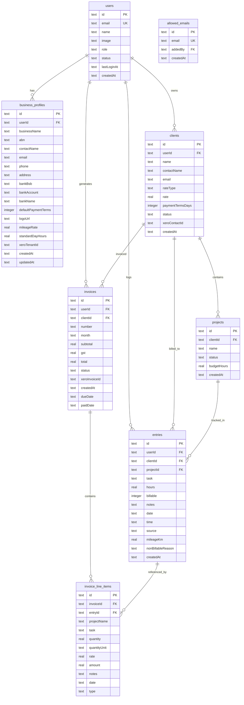
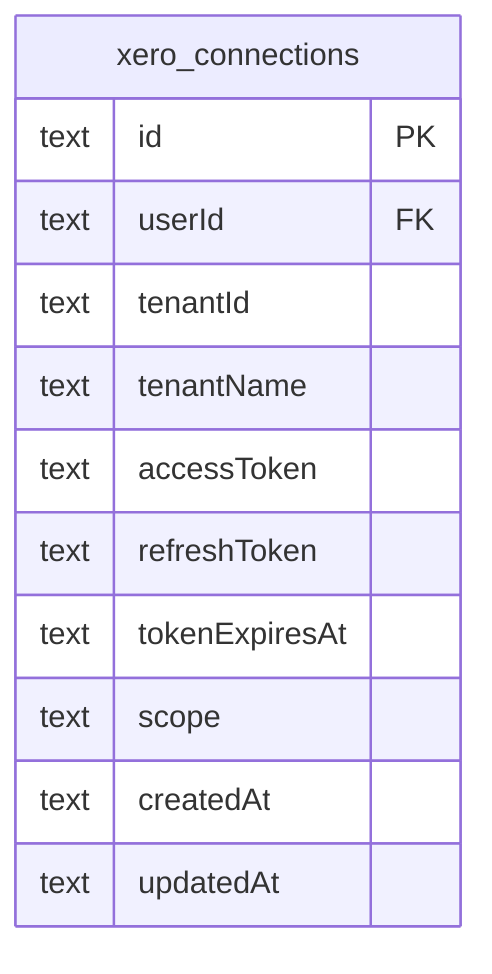

# feat: PiTime — Voice-Activated Timesheet & Invoice App

## Overview

Build PiTime as a **Next.js 15 app** deployed on Vercel at `app.pirisk.com.au`, integrated with the existing static pirisk.com.au marketing site. PiTime lets Allerick (a solo construction commercial consultant) capture time entries via voice/text, manage clients and projects, generate invoices with GST, and view a utilisation dashboard — all behind Google OAuth authentication.

**Key architectural shift from original spec:** The app moves from a single React `.jsx` artefact with `window.storage` to a full-stack Next.js app with Turso database, NextAuth v5 Google OAuth, and server-side API routes. This provides real persistence, authentication, and a foundation for future multi-user support.

**UI requirement:** The frontend must be designed with maximum visual impact — modern, premium, construction-industrial aesthetic. The `/frontend-design` skill MUST be used during implementation for every UI component. Think dark nav, bold typography (Outfit + Source Sans 3 + JetBrains Mono), construction orange accents, smooth animations, and a design that would make a SaaS founder jealous.

## Problem Statement / Motivation

Allerick currently tracks time across multiple construction clients using manual methods. He needs a tool that:
1. Captures time entries as fast as speaking — voice-first, via Wispr Flow
2. Auto-categorises entries by client, project, and task using AI
3. Generates professional invoices with Australian GST and bank details
4. Shows where his time (and money) is going
5. Is accessible from any device (phone on-site, laptop in office)
6. Is secure — only Allerick (and future team members) can access it
7. Hangs off his existing pirisk.com.au brand

## Proposed Solution

### Deployment Architecture

**Single Next.js app on Vercel — migrate pirisk.com.au from Netlify.**

```
pirisk.com.au (Vercel — Next.js 15)
├── / (public)           ← Marketing site (migrated static pages)
│   ├── page.tsx          ← Hero, Services, About, Contact (from index.html)
│   ├── styles (Tailwind) ← Rebuilt from styles.css
│   └── Grace chatbot     ← Assistable widget (unchanged)
│
├── /login (public)       ← Google Sign-In page
├── /api/auth/* (public)  ← NextAuth routes
│
├── /app/* (protected)    ← PiTime app (behind auth)
│   ├── /app              ← Log Time (default)
│   ├── /app/timesheet
│   ├── /app/invoices
│   ├── /app/dashboard
│   ├── /app/clients
│   └── /app/settings
│
├── Turso/SQLite via Drizzle ORM
├── Server-side Claude API route
└── NextAuth v5 Google OAuth
```

**Why migrate to a single Vercel app (not keep Netlify + subdomain):**
- One platform, one deployment pipeline, one DNS config
- No CORS or cookie-domain issues between marketing site and app
- Marketing pages become server-rendered Next.js (better SEO, faster)
- Shared layout/nav — "PiTime" link is just a route, not a cross-domain redirect
- Vercel handles Next.js natively (serverless functions, edge middleware)
- Eliminates maintaining two separate hosting setups
- pirisk.com.au domain simply repoints from Netlify to Vercel

### Technology Stack (mirroring sprint-tracker)

| Layer | Technology | Version |
|-------|-----------|---------|
| Framework | Next.js (App Router) | 15.x |
| Language | TypeScript | 5.x |
| Auth | NextAuth (Auth.js) | v5 beta |
| Database | Turso (libSQL) | — |
| ORM | Drizzle ORM | 0.45+ |
| Styling | Tailwind CSS | 4.x |
| Charts | Recharts | 2.x |
| Icons | Lucide React | latest |
| AI | Claude API (server-side) | claude-sonnet-4-20250514 |
| Fonts | Outfit, Source Sans 3, JetBrains Mono | Google Fonts |
| Deployment | Vercel | — |

## Technical Approach

### Architecture

```
┌─────────────────────────────────────────────────┐
│  Browser (Client)                                │
│  ┌───────────┐ ┌──────────┐ ┌────────────────┐  │
│  │ Voice/Text│ │ Timer    │ │ Dashboard/     │  │
│  │ Input     │ │ Widget   │ │ Charts         │  │
│  └─────┬─────┘ └────┬─────┘ └───────┬────────┘  │
│        │             │               │            │
│        └─────────────┼───────────────┘            │
│                      │                            │
└──────────────────────┼────────────────────────────┘
                       │ HTTPS
┌──────────────────────┼────────────────────────────┐
│  Next.js Server (Vercel)                          │
│  ┌───────────────────┼──────────────────────────┐ │
│  │ Middleware (auth.config.ts)                   │ │
│  │ - Route protection                            │ │
│  │ - JWT validation                              │ │
│  └───────────────────┼──────────────────────────┘ │
│  ┌───────────────────┼──────────────────────────┐ │
│  │ API Routes                                    │ │
│  │ /                        ← Marketing site      │ │
│  │ /api/auth/[...nextauth]  ← Google OAuth       │ │
│  │ /api/parse-entry         ← Claude API proxy   │ │
│  │ /api/entries             ← CRUD               │ │
│  │ /api/clients             ← CRUD               │ │
│  │ /api/invoices            ← Generate/manage    │ │
│  │ /api/dashboard           ← Aggregated stats   │ │
│  └───────────────────┼──────────────────────────┘ │
│                      │                            │
│  ┌───────────────────┼──────────────────────────┐ │
│  │ Drizzle ORM → Turso (libSQL)                 │ │
│  └──────────────────────────────────────────────┘ │
└───────────────────────────────────────────────────┘
```

### Database Schema (Drizzle ORM)



**Key schema decisions:**
- Fully normalised — `projects` is a separate table with `clientId` FK
- `entries` use foreign keys (`clientId`, `projectId`) — no denormalised names
- `invoice_line_items` is a join table referencing both `invoiceId` and `entryId`
- **`rateType`** on clients: `"hourly"` or `"daily"` — determines how `rate` is applied
  - `hourly`: rate × hours = amount (e.g. $275/hr × 2.5h = $687.50)
  - `daily`: rate × days = amount (e.g. $2,200/day × 1 day). Hours still tracked for reference, but billing is per-day. A "day" = 8 hours by default (configurable in business profile as `standardDayHours`). Partial days are pro-rated: 4h logged on a daily client = 0.5 days × $2,200 = $1,100.
- **`rate`** replaces `hourlyRate` — stores the numeric rate regardless of type
- `mileageKm` on entries, `mileageRate` on business_profiles (configurable, default $0.91/km)
- `nonBillableReason` as enum text on entries
- `budgetHours` on projects (nullable — only set if budget tracking desired)
- `type` on invoice_line_items: `"time"` or `"mileage"` (mileage = separate line item, GST applies)
- **`xeroContactId`** on clients — maps to Xero Contact for sync
- **`xeroInvoiceId`** on invoices — maps to Xero Invoice for sync

### Authentication Flow (Same as sprint-tracker)

```
User visits app.pirisk.com.au
    → Middleware checks JWT cookie
    → No session? Redirect to /login
    → /login shows Google Sign-In button
    → User clicks → Google OAuth flow
    → Callback: check email against allowed_emails table
    → Allowed? Upsert user record, issue JWT, redirect to /
    → Denied? Show "Access denied" error on /login
```

**Files to replicate from sprint-tracker:**
- `src/lib/auth.ts` — NextAuth config with Google provider
- `src/lib/auth.config.ts` — Route protection, JWT strategy (24h)
- `src/lib/auth-helpers.ts` — `requireAuth()` / `requireAdmin()`
- `src/app/api/auth/[...nextauth]/route.ts` — Route handler
- `src/app/login/page.tsx` — Login page (restyled for PiRisk brand)
- `src/types/next-auth.d.ts` — Session type extensions
- `src/lib/actions/users.ts` — User management functions

**Auth configuration:**
- Email allowlist stored in `allowed_emails` database table (not env var)
- Initially seeded with `allerick@pirisk.com.au`
- Admin can add/remove emails from Settings tab
- JWT sessions, 24-hour expiry
- `prompt: "select_account"` on Google OAuth

### Claude API Integration (Server-Side)

```
POST /api/parse-entry
├── requireAuth() check
├── Read user's clients + active projects from DB
├── Build system prompt with client/project context
├── POST to api.anthropic.com/v1/messages
│   └── Model: claude-sonnet-4-20250514
│   └── Timeout: 10 seconds
├── Parse response JSON
├── Return structured entry to client
└── On failure: return { error: "parse_failed" } → client shows manual form
```

**Key change from original spec:** API key stored as `ANTHROPIC_API_KEY` env var on Vercel, never exposed to client. This eliminates the security concern of client-side API calls.

## Implementation Phases

### Development Methodology: Test-Driven Development (TDD)

**Every phase follows strict TDD. No implementation code is written before its tests exist.**

```
For each feature/component:
1. WRITE failing tests first (unit + integration)
2. VERIFY tests fail (red)
3. Write minimum implementation to pass
4. VERIFY tests pass (green)
5. Refactor if needed
6. VERIFY tests still pass
```

**Test stack:**
| Layer | Tool | What it covers |
|-------|------|---------------|
| Unit tests | Vitest | Pure functions: rate calculations, date formatting, GST math, invoice numbering, hours→days conversion, aged receivables bucketing |
| Component tests | Vitest + React Testing Library | UI components: forms render, inputs validate, confirmation cards display correct confidence colours |
| API route tests | Vitest + MSW (Mock Service Worker) | API routes: auth checks, CRUD operations, Claude API proxy, Xero sync |
| Integration tests | Vitest + Drizzle test DB | Full flows: create client → log entry → generate invoice → verify line items and totals |
| E2E tests | Playwright | Critical user journeys: login → log time → view timesheet → generate invoice → push to Xero |

**Test file convention:** Every source file `src/foo/bar.ts` has a corresponding `src/foo/__tests__/bar.test.ts`.

**What gets tested per phase:**

- **Phase 0 (Migration):** Visual regression screenshots (Playwright), all marketing page sections render, Grace widget loads, nav links work
- **Phase 1 (Auth):** Auth middleware blocks unauthenticated access, allows public routes, Google OAuth callback works, email allowlist rejects unlisted emails, JWT session contains correct user data
- **Phase 2 (Time Entry):** Claude API parsing returns correct structure for various voice inputs (mock Claude responses), hours round to 0.25, mileage extracted, non-billable signals detected, timer calculates elapsed correctly, quick templates derive from entry history
- **Phase 3 (Clients/Timesheet):** Client CRUD validation, rate type (hourly/daily) stored correctly, project budget percentage calculation, entry locking on invoiced entries, clipboard export format matches spec
- **Phase 4 (Invoices):** Invoice number generation is sequential and collision-free, GST calculation (10% exact), hourly billing: hours × rate = amount, daily billing: hours ÷ standardDayHours × rate = amount, mileage line items calculated correctly, status transitions enforce rules (can't skip draft→paid)
- **Phase 5 (Dashboard):** Metric aggregations match raw data, aged receivables buckets calculated from issue date, non-billable breakdown sums to total non-billable hours, charts receive correct data shape
- **Phase 6 (Settings):** Business profile saves/loads all fields including mileage rate and standardDayHours, email allowlist add/remove works, data export produces valid reimportable JSON
- **Phase 7 (Xero):** OAuth token refresh logic, contact mapping (auto-match by email), invoice push builds correct Xero payload (hourly vs daily line items), webhook HMAC verification rejects invalid signatures, payment webhook updates invoice status

**CI pipeline:**
```
git push → Vercel build → vitest run → playwright test → deploy (if all pass)
```

Tests are NOT optional. A phase is not complete until its test suite passes.

---

### Phase 0: Netlify → Vercel Migration (Marketing Site)

**Goal:** Migrate pirisk.com.au from static Netlify hosting to a Next.js app on Vercel — preserving the existing marketing site pixel-perfect while creating the foundation for PiTime.

**Pre-migration checklist:**
- [ ] Document current Netlify config (redirects, headers, custom domain settings)
- [ ] Screenshot every section of pirisk.com.au for visual regression comparison
- [ ] Note DNS provider (Route 53 or Netlify DNS per README)
- [ ] Verify Assistable widget config (`window.ASSISTABLE_CONFIG`) works in Next.js

**Tasks:**
1. Scaffold Next.js 15 app with TypeScript, Tailwind CSS 4, App Router
2. Convert `index.html` → `src/app/page.tsx` (marketing homepage)
   - Hero section with CTAs
   - Services section (6 cards with Intersection Observer animations)
   - About section with stats (20+ Years, 100% Client Focused, $67M+ Recovered)
   - Contact section with form + Grace AI widget
3. Convert `styles.css` → Tailwind classes (preserving exact design: colours, spacing, responsive breakpoints)
4. Convert `script.js` → React components:
   - Mobile hamburger menu → client component with state
   - Navbar scroll shadow → `useEffect` with scroll listener
   - Smooth scroll anchors → Next.js scroll behaviour
   - Contact form → server action or client-side handler
   - Intersection Observer animations → Framer Motion or CSS transitions
   - Assistable Grace widget → `<Script>` component with `afterInteractive` strategy
5. Move `logo.png` to `public/logo.png`
6. Create Vercel project, connect GitHub repo
7. Deploy to Vercel on a preview URL — visually compare against live site screenshots
8. **DNS cutover:** Repoint `pirisk.com.au` from Netlify → Vercel
   - If using Netlify DNS: switch to Vercel DNS or external DNS provider
   - If using Route 53: update A/CNAME records to Vercel's IP/CNAME
   - Vercel auto-provisions SSL
9. Verify live site matches original pixel-for-pixel
10. Decommission Netlify site (keep as backup for 30 days, then delete)

**Files:**
```
src/
├── app/
│   ├── layout.tsx                    # Root layout, fonts (Inter → later Outfit/Source Sans)
│   ├── page.tsx                      # Marketing homepage (from index.html)
│   └── components/
│       ├── navbar.tsx                # Fixed nav with scroll shadow
│       ├── hero.tsx                  # Hero section with CTAs
│       ├── services.tsx              # 6 service cards with animations
│       ├── about.tsx                 # Company info + stats
│       ├── contact.tsx               # Contact form + Grace widget
│       └── footer.tsx                # Footer links
├── public/
│   └── logo.png
├── vitest.config.ts                  # Vitest configuration
├── playwright.config.ts              # Playwright configuration
└── package.json
```

**Tests (written FIRST):**
```
src/app/__tests__/
├── page.test.tsx                     # Marketing page renders all sections
├── components/
│   ├── navbar.test.tsx               # Scroll shadow, mobile menu, nav links
│   ├── hero.test.tsx                 # CTAs render, links correct
│   ├── services.test.tsx             # All 6 cards render
│   ├── contact.test.tsx              # Form validation, submission
│   └── footer.test.tsx               # Links present
e2e/
├── marketing.spec.ts                 # Playwright: full page visual regression
└── navigation.spec.ts               # Playwright: all anchor links scroll correctly
```

**Migration risk mitigation:**
- Keep Netlify site live until Vercel is verified working on production domain
- Use Vercel preview deployments for testing before DNS cutover
- If anything goes wrong, DNS revert to Netlify takes ~5 minutes (low TTL)

**Success criteria:**
- [ ] pirisk.com.au serves from Vercel
- [ ] All sections render identically to current Netlify version
- [ ] Grace chatbot (Assistable) works correctly
- [ ] Contact form functions
- [ ] Mobile responsive layout preserved
- [ ] Google PageSpeed score equal or better than current
- [ ] SSL working on pirisk.com.au

**Estimated effort:** 2-3 hours

---

### Phase 1: Foundation (Auth + Data Layer)

**Goal:** Add Google Auth and Turso database to the now-Vercel-hosted Next.js app.

**Tasks:**
1. Configure Turso database + Drizzle ORM schema (all tables from ERD above)
2. Run initial migration
3. Replicate NextAuth v5 Google OAuth from sprint-tracker
4. Create login page with PiRisk branding (dark navy, construction orange)
5. Seed `allowed_emails` with `allerick@pirisk.com.au`
6. Add middleware: marketing pages (/) are public, /app/* routes are protected
7. Add "PiTime" link to marketing site navbar (visible to all, redirects to /login if not authed)

**Files (added to Phase 0 scaffold):**
```
src/
├── app/
│   ├── login/page.tsx                # Google sign-in page
│   ├── api/auth/[...nextauth]/route.ts
│   └── (app)/                        # Protected routes group
│       └── layout.tsx                # PiTime app shell with tab nav
├── lib/
│   ├── auth.ts                       # NextAuth config (from sprint-tracker)
│   ├── auth.config.ts                # Route protection: / public, /app/* protected
│   ├── auth-helpers.ts               # requireAuth() / requireAdmin()
│   ├── db/
│   │   ├── index.ts                  # Turso client
│   │   └── schema.ts                 # Drizzle schema (all tables from ERD)
│   └── actions/
│       └── users.ts                  # User management (from sprint-tracker)
├── types/
│   └── next-auth.d.ts                # Session type extensions
├── middleware.ts                      # NextAuth middleware
├── drizzle.config.ts
└── .env.local.example
```

**Tests (written FIRST):**
```
src/lib/__tests__/
├── auth.test.ts                      # signIn callback: allowlist check, user upsert
├── auth-helpers.test.ts              # requireAuth returns 401 when no session
├── auth-config.test.ts               # authorized callback: public vs protected routes
└── actions/users.test.ts             # isEmailAllowed, upsertUser, CRUD
e2e/
├── auth.spec.ts                      # Login flow, session persistence, sign out
└── protected-routes.spec.ts          # /app/* blocked, / public, /login public
```

**Auth middleware routing:**
```
/                    → public (marketing site)
/login               → public (sign-in page)
/api/auth/*          → public (NextAuth handlers)
/app/*               → protected (redirect to /login if no session)
/api/*  (non-auth)   → protected (return 401 if no session)
```

**Success criteria:**
- [ ] Marketing site still works at pirisk.com.au (from Phase 0)
- [ ] /login shows Google sign-in page with PiRisk branding
- [ ] Google OAuth works, redirects to /app after login
- [ ] Non-allowlisted emails see "Access denied"
- [ ] /app/* routes redirect to /login when unauthenticated
- [ ] Database tables created and accessible via Drizzle
- [ ] "PiTime" link visible in marketing nav, links to /app

**Estimated effort:** 2 hours

---

### Phase 2: Core Time Entry (Voice + Manual + Timer)

**Goal:** The primary feature — log time entries via voice, manual form, or timer.

**Tasks:**
1. Create `/api/parse-entry` route (Claude API proxy, server-side)
2. Build SmartInput component — large text area, "What did you work on?" placeholder
3. Build ConfirmationCard — parsed fields with green/amber/red confidence indicators
4. Build ManualEntryForm — dropdowns for client, project, task + hours + notes
5. Build TimerWidget — start/stop with elapsed time, rounds to 0.25h
6. Build QuickStats — today's entries list, today's total hours
7. Build **Repeat Entry buttons** — last 5 unique client+project+task combos as one-tap shortcuts
8. Create `/api/entries` CRUD routes
9. Wire up voice → parse → confirm → save flow

**Smart Input parsing — Claude system prompt includes:**
- Active clients and their projects (from DB)
- Task categories: Contract Review, Site Inspection, EOT Assessment, Delay Analysis, Cost Assessment, Defects Review, Progress Claim, Variation Assessment, Meeting, Phone Call, Report Writing, Document Review, Travel, Admin, Other
- Mileage detection: "45km", "round trip 30km", etc.
- Non-billable signals: "don't bill", "non-billable", "no charge", "quick call", "internal", "admin"

**Timer persistence:** Timer state stored in `localStorage` (survives tab switches and page navigations). On app mount, check for running timer and restore it. If browser crashes, timer start time is preserved — elapsed time is recalculated on next visit.

**Quick Templates logic:**
- Query last 50 entries for the current user
- Group by `clientId + projectId + task`
- Sort by frequency (most common first), then recency as tiebreaker
- Show top 5 as pill buttons above the smart input
- One tap → pre-fills client, project, task. User enters hours + notes only.

**Files:**
```
src/app/(app)/
├── page.tsx                          # Log Time tab (default)
├── api/
│   ├── parse-entry/route.ts          # Claude API proxy
│   └── entries/route.ts              # GET/POST entries
└── components/
    ├── smart-input.tsx
    ├── confirmation-card.tsx
    ├── manual-entry-form.tsx
    ├── timer-widget.tsx
    ├── quick-stats.tsx
    └── quick-templates.tsx
```

**Success criteria:**
- [ ] User can type/dictate text and get AI-parsed time entry
- [ ] Confirmation card shows with confidence indicators
- [ ] User can confirm, edit, or discard parsed entry
- [ ] Manual entry form works as fallback
- [ ] Timer mode works (start/stop → hours rounded to 0.25)
- [ ] Quick template buttons appear and pre-fill entries
- [ ] Mileage parsed from voice ("45km round trip")
- [ ] Non-billable signals detected ("don't bill" → billable: false)
- [ ] All entries persisted to Turso

**Estimated effort:** 4-5 hours

---

### Phase 3: Clients, Projects & Timesheet

**Goal:** Manage clients/projects and view/edit/filter time entries.

**Tasks:**
1. Build Clients tab — list, add, edit, archive clients
2. Build nested Projects — add, edit, set status (active/completed/on-hold)
3. Per-client rate configuration: **hourly or daily**
   - Rate type selector: "Hourly" or "Daily" radio/toggle
   - Rate input: dollar amount ($275/hr or $2,200/day)
   - Daily rate clients: hours still logged normally, but invoicing converts hours → days using `standardDayHours` (default 8h, configurable in business profile)
   - Invoice line items show: quantity in days (e.g. "1.5 days"), unit = daily rate
   - Timesheet/dashboard still show hours for all clients (consistent tracking unit)
4. **Project budget field** — optional `budgetHours`, shown as progress bar
5. Build Timesheet tab — filterable table (month, client, project, billable toggle)
6. Timesheet summary row — total hours, billable hours, non-billable hours, amount
7. Inline edit and delete with confirmation
8. **Copy Timesheet to Clipboard** — formatted plain-text table
9. Create `/api/clients` and `/api/projects` CRUD routes

**Budget tracking:**
- `budgetHours` is optional on each project
- Progress bar shows: `totalHoursLogged / budgetHours`
- Green < 75%, amber 75-100%, red > 100%
- Tracks ALL hours (billable + non-billable) against budget
- Visible on: project list under client, timesheet summary, dashboard
- No hard block on exceeding budget — visual warning only

**Copy to Clipboard format:**
```
PiRisk Management — Timesheet
Meriton Group | April 2026
───────────────────────────────────────────────────
Date       Project          Task              Hours    Amount
03/04/26   Bondi Tower      Contract Review    2.50   $687.50
03/04/26   Bondi Tower      Site Inspection    3.00   $825.00
07/04/26   Mascot Stage 2   Delay Analysis     4.00   $1,100.00
───────────────────────────────────────────────────
                              Total Billable:   9.50   $2,612.50
                              Non-billable:     1.25
                              Total:           10.75
```

**Entry locking rules:**
- Entries on `draft` invoices: editable, but warn "this entry is on draft invoice INV-xxx"
- Entries on `sent` invoices: locked (read-only). User must void/regenerate invoice first.
- Entries on `paid` invoices: locked permanently.

**Files:**
```
src/app/(app)/
├── clients/page.tsx                  # Clients tab
├── timesheet/page.tsx                # Timesheet tab
├── api/
│   ├── clients/route.ts             # GET/POST/PUT clients
│   └── projects/route.ts            # GET/POST/PUT projects
└── components/
    ├── client-list.tsx
    ├── client-form.tsx
    ├── project-list.tsx
    ├── project-budget-bar.tsx
    ├── timesheet-filters.tsx
    ├── timesheet-table.tsx
    ├── timesheet-summary.tsx
    └── copy-timesheet-button.tsx
```

**Success criteria:**
- [ ] Clients CRUD works with hourly rates
- [ ] Projects CRUD nested under clients with status management
- [ ] Budget hours field on projects, progress bar displays correctly
- [ ] Timesheet shows all entries with filters working
- [ ] Inline edit/delete with appropriate locking for invoiced entries
- [ ] Copy to clipboard produces clean table format
- [ ] Only active clients/projects appear in time entry dropdowns

**Estimated effort:** 3-4 hours

---

### Phase 4: Invoices

**Goal:** Generate, view, and manage invoices with GST and professional layout.

**Tasks:**
1. Build invoice generation flow: select month + client → preview billable entries → generate
2. Auto-number: `INV-YYYYMM-NNN` (sequential, database counter with transaction lock)
3. Line items grouped by project, then by task
4. **Mileage as separate line items** — `km × mileageRate`, type: "mileage"
5. GST calculation (10% on all line items including mileage)
6. Professional invoice display (matching original spec layout — printable via Ctrl+P)
7. Status management: draft → sent → paid (manual toggles)
8. Overdue detection: if status === "sent" && now > dueDate
9. **Aged Receivables** data (used by dashboard in Phase 5)
10. Create `/api/invoices` routes

**Invoice immutability rules:**
- `draft`: fully editable, can regenerate, can delete
- `sent`: read-only. To modify, user must revert to draft first.
- `paid`: permanently locked. Paid date recorded.
- Overdue is a display state, not a stored status (calculated from sent + dueDate)

**Mileage on invoices:**
- Each entry with `mileageKm > 0` generates an additional line item
- Line item: `{ type: "mileage", task: "Travel — [project]", hours: null, rate: mileageRate, amount: km * rate }`
- GST applies (invoiced to client as a service, not a personal ATO claim)
- Displayed in a separate "Travel / Mileage" section on the invoice below the time entries

**Files:**
```
src/app/(app)/
├── invoices/page.tsx                 # Invoices tab
├── api/invoices/route.ts             # GET/POST/PUT invoices
└── components/
    ├── invoice-generator.tsx
    ├── invoice-preview.tsx
    ├── invoice-list.tsx
    └── invoice-status-badge.tsx
```

**Success criteria:**
- [ ] Invoice generation per client per month with grouped line items
- [ ] Mileage appears as separate line items when present
- [ ] Invoice number auto-generated correctly (no duplicates)
- [ ] GST calculated at 10% on subtotal (time + mileage)
- [ ] Invoice displays business details, ABN, bank details
- [ ] Status toggles work (draft → sent → paid)
- [ ] Overdue invoices detected and highlighted
- [ ] Invoice is printable via browser (clean layout, no app chrome)

**Estimated effort:** 3-4 hours

---

### Phase 5: Dashboard

**Goal:** At-a-glance view of utilisation, revenue, and outstanding money.

**Tasks:**
1. Metric cards: total hours, billable hours, non-billable hours, billable amount ($), utilisation rate, non-billable leakage ($)
2. Revenue by client (bar chart — Recharts)
3. Hours by project (bar chart)
4. Monthly revenue trend (line chart, last 6 months)
5. Billable vs non-billable split (stacked bar, last 3 months)
6. **Aged Receivables widget** — buckets: Current, 30+, 60+, 90+ days
7. Outstanding invoices list with overdue highlighting
8. **Non-billable breakdown** — pie chart by reason tag (travel, admin, business-dev, rework, waiting)
9. **Project budget overview** — top 5 projects by budget consumption

**Aged Receivables calculation:**
- Ageing from **invoice issue date** (createdAt), not due date — construction industry standard
- Current = issued ≤ 30 days ago AND not paid
- 30+ = issued 31-60 days ago AND not paid
- 60+ = issued 61-90 days ago AND not paid
- 90+ = issued > 90 days ago AND not paid
- Each bucket shows: count of invoices, total $ amount
- Colour coding: Current (blue), 30+ (amber), 60+ (orange), 90+ (red)

**Non-billable reason tags:**
- Available tags: `travel`, `admin`, `business-dev`, `rework`, `waiting`
- When `billable: false`, entry form shows tag selector (optional but encouraged)
- Dashboard pie chart shows proportion of non-billable hours by tag
- Filterable in timesheet view

**Files:**
```
src/app/(app)/
├── dashboard/page.tsx                # Dashboard tab
├── api/dashboard/route.ts            # Aggregated stats
└── components/
    ├── metric-cards.tsx
    ├── revenue-by-client-chart.tsx
    ├── hours-by-project-chart.tsx
    ├── monthly-trend-chart.tsx
    ├── billable-breakdown-chart.tsx
    ├── aged-receivables.tsx
    ├── outstanding-invoices.tsx
    ├── non-billable-breakdown.tsx
    └── project-budget-overview.tsx
```

**Success criteria:**
- [ ] All 6 metric cards display correctly for current month
- [ ] All 4 charts render with real data (Recharts)
- [ ] Aged receivables shows correct bucketing from invoice issue date
- [ ] Outstanding invoices listed with overdue highlighting in red
- [ ] Non-billable breakdown pie chart shows reason tags
- [ ] Project budget overview shows top projects by consumption
- [ ] Dashboard is responsive on mobile

**Estimated effort:** 3-4 hours

---

### Phase 6: Settings + Polish

**Goal:** Business profile management, data tools, and final polish.

**Tasks:**
1. Business Profile form: name, ABN, contact, email, phone, address, bank details, payment terms, logo URL, **mileage rate** (default $0.91/km)
2. Email allowlist management: add/remove allowed emails (admin only)
3. Data export as JSON (all tables)
4. Data import from JSON (for migration from any previous version)
5. First-time setup flow: if no business profile exists, redirect to Settings on first login
6. Mobile responsiveness pass — ensure all tabs work on phone
8. Print stylesheet for invoices
9. Loading states, error boundaries, toast notifications

**Files:**
```
src/app/(app)/
├── settings/page.tsx                 # Settings tab
└── components/
    ├── business-profile-form.tsx
    ├── email-allowlist.tsx
    ├── data-management.tsx
    └── onboarding-wizard.tsx
```

**Success criteria:**
- [ ] Business profile editable with all fields including mileage rate
- [ ] Email allowlist manageable from Settings (admin only)
- [ ] Data export produces valid JSON of all data
- [ ] First-time user sees onboarding flow
- [ ] App works on mobile (phone at construction site)
- [ ] Invoices print cleanly (no app chrome, proper layout)
- [ ] Marketing site navbar has "PiTime" link to /app

**Estimated effort:** 2-3 hours

## UI / UX Design Direction

**CRITICAL: Use `/frontend-design` skill during implementation of every component.**

**Aesthetic:** Premium industrial. Dark surfaces, bold type, high contrast. This should look like a tool built for someone who bills $275/hour — confident, sharp, no-nonsense. Not corporate SaaS grey. Not playful startup. Think Bloomberg Terminal meets construction site.

**Design system:**
```
Colours:
  Primary:      #0A1628 (dark navy — nav, headers)
  Accent:       #E8590C (construction orange — CTAs, active states, hover)
  Success:      #2B8A3E (green — paid, billable, confirmed)
  Warning:      #E67700 (amber — overdue, low confidence)
  Danger:       #C92A2A (red — delete, errors, 90+ days overdue)
  Surface:      #FFFFFF (cards)
  Background:   #F8F9FA (page background — slightly warmer than spec's #F1F3F5)
  Muted text:   #868E96
  Border:       #DEE2E6

Typography:
  Headings:     Outfit (geometric, sturdy)
  Body:         Source Sans 3 (readable, professional)
  Numbers:      JetBrains Mono (monospace — amounts, hours, dates)

Spacing:
  Base unit: 4px
  Card padding: 24px
  Section gap: 32px

Radius:
  Cards: 12px
  Buttons: 8px
  Inputs: 8px
  Pills/tags: 9999px (full round)

Shadows:
  Card: 0 1px 3px rgba(0,0,0,0.04), 0 1px 2px rgba(0,0,0,0.06)
  Card hover: 0 4px 6px rgba(0,0,0,0.07)
  Nav: 0 1px 3px rgba(0,0,0,0.1)
```

**Layout:**
- Fixed top bar: PiRisk logo + app name + today's hours / month revenue + user avatar
- Tab navigation: Log Time | Timesheet | Invoices | Dashboard | Clients | Settings
- Content area with max-width 1200px, centred
- Cards with subtle shadows, generous whitespace
- Smooth transitions on all interactive elements (150ms ease)

**Mobile priority:** Log Time tab must be thumb-friendly. Large input, large confirm button. Timer accessible with one tap. Quick template pills easily tappable.

**Animations:**
- Card entrance: fade-in + slight translate-y (staggered)
- Tab switch: crossfade
- Toast: slide in from top-right
- Confirmation card: scale-in from 95%
- Chart data: animated on mount

## Alternative Approaches Considered

| Approach | Why Rejected |
|----------|-------------|
| Keep as Claude artefact with window.storage | No real persistence, no auth, no multi-device, can't integrate with pirisk.com.au |
| Keep Netlify for marketing + Vercel subdomain for app | Two hosting platforms to maintain, CORS/cookie issues, cross-domain auth complexity, two DNS configs |
| Firebase Auth instead of NextAuth | Sprint-tracker already has proven NextAuth pattern; no reason to introduce a different auth system |
| Supabase instead of Turso | Sprint-tracker uses Turso; maintaining consistency across projects reduces cognitive load |
| Client-side Claude API calls | Exposes API key in browser; server-side route is more secure |
| Separate domain (pitime.app or similar) | Unnecessary — same domain keeps it under the PiRisk brand |
| Keep Netlify for static site, path-proxy to Vercel | Fragile proxy setup, Netlify can't run Next.js server-side natively |

## System-Wide Impact

### Interaction Graph
- User login → NextAuth → Google OAuth → signIn callback → email allowlist check → upsert user → JWT issued
- Voice entry submit → /api/parse-entry → Claude API → response parsed → /api/entries POST → Turso insert → client state update
- Invoice generate → /api/invoices POST → read entries → calculate amounts (hourly: hours × rate, daily: hours ÷ standardDayHours × rate) → create invoice + line items (transaction) → Turso insert
- Invoice push to Xero → /api/xero/push-invoice → refresh token if needed → map client → xeroContactId, build line items → POST to Xero Accounting API → store xeroInvoiceId
- Payment received in Xero → Xero webhook POST /api/xero/webhook → verify HMAC → find invoice by xeroInvoiceId → update status to "paid"

### Error Propagation
- Claude API timeout (10s) → server returns `{ error: "parse_failed" }` → client shows manual entry form
- Turso connection failure → API routes return 500 → client shows "Connection error, please retry" toast
- Auth token expired → middleware redirects to /login → user re-authenticates via Google

### State Lifecycle Risks
- **Invoice generation must be transactional:** create invoice + all line items in one transaction. Partial failure must not leave orphaned line items or invoices without line items.
- **Entry deletion with invoice reference:** check if entry is on any invoice before allowing delete. Blocked if on sent/paid invoice.
- **Timer state in localStorage:** if user clears browser data, running timer is lost. Acceptable risk for MVP.

### API Surface Parity
- All data mutations go through server-side API routes
- No direct database access from client components
- Session checked on every API route via `requireAuth()`

## Acceptance Criteria

### Functional Requirements
- [ ] Google OAuth login works with email allowlist
- [ ] Voice/text entry parsed by Claude API (server-side)
- [ ] Confirmation card with confidence indicators (green/amber/red)
- [ ] Manual entry form as fallback
- [ ] Timer mode (start/stop → rounded hours)
- [ ] Quick template buttons (top 5 recent combos)
- [ ] Clients CRUD with per-client rate (hourly or daily, configurable per client)
- [ ] Projects CRUD with active/completed/on-hold status
- [ ] Project budget tracking with progress bar
- [ ] Timesheet view with filters, inline edit, delete
- [ ] Entry locking for invoiced entries
- [ ] Copy timesheet to clipboard as formatted table
- [ ] Invoice generation per client/month with GST
- [ ] Mileage as separate invoice line items
- [ ] Invoice status management (draft → sent → paid → overdue)
- [ ] Dashboard with 6 metric cards + 4 charts
- [ ] Aged receivables widget (Current / 30+ / 60+ / 90+)
- [ ] Non-billable breakdown by reason tag
- [ ] Business profile management with configurable mileage rate
- [ ] Email allowlist management from Settings
- [ ] Data export as JSON
- [ ] Xero OAuth2 connection from Settings
- [ ] Clients sync to/from Xero Contacts
- [ ] Invoices push to Xero with line items and GST
- [ ] Invoice payment status syncs back from Xero via webhook

### Non-Functional Requirements
- [ ] Mobile-responsive (usable on phone at construction site)
- [ ] Page load < 2s on 4G connection
- [ ] Claude API parsing < 5s end-to-end
- [ ] Invoice printable via browser Ctrl+P (clean layout)
- [ ] All money in AUD with $ and commas
- [ ] All dates in Australian format (DD/MM/YYYY) for display, ISO for storage
- [ ] Hours rounded to nearest 0.25 (15-minute increments)

### Quality Gates
- [ ] **TDD enforced:** Every feature has tests written BEFORE implementation (`/tdd-first` skill active)
- [ ] **All unit tests pass:** `vitest run` — 0 failures
- [ ] **All E2E tests pass:** `playwright test` — 0 failures
- [ ] **Verification before completion:** Evidence of passing tests shown before any phase is declared done (`/verification-before-completion` skill active)
- [ ] `/frontend-design` skill used for every UI component
- [ ] All API routes protected with `requireAuth()`
- [ ] No API keys exposed to client
- [ ] TypeScript strict mode, no `any` types
- [ ] Error boundaries on all pages
- [ ] Loading states on all async operations

## Dependencies & Prerequisites

- [ ] Vercel: Create project, connect GitHub repo
- [ ] DNS: Repoint `pirisk.com.au` from Netlify → Vercel (Phase 0)
- [ ] Google Cloud Console: Create OAuth credentials (redirect URI: `https://pirisk.com.au/api/auth/callback/google`)
- [ ] Turso: Create database instance (Sydney region for AU latency)
- [ ] Anthropic: API key for Claude (server-side env var)
- [ ] Xero: Create app in Xero developer portal (OAuth2, redirect URI: `https://pirisk.com.au/api/xero/callback`)
- [ ] Xero: Register webhook endpoint (`https://pirisk.com.au/api/xero/webhook`)
- [ ] Netlify: Keep as backup for 30 days after migration, then decommission

## Environment Variables

```env
# Auth
AUTH_SECRET=           # npx auth secret
AUTH_GOOGLE_ID=        # Google Cloud Console (redirect: pirisk.com.au/api/auth/callback/google)
AUTH_GOOGLE_SECRET=    # Google Cloud Console

# Database
TURSO_DATABASE_URL=    # Turso dashboard (Sydney region)
TURSO_AUTH_TOKEN=      # Turso dashboard

# AI
ANTHROPIC_API_KEY=     # Anthropic dashboard

# Xero
XERO_CLIENT_ID=        # Xero developer portal (My Apps)
XERO_CLIENT_SECRET=    # Xero developer portal
XERO_WEBHOOK_KEY=      # Xero developer portal (webhook signing key)

# App
NEXT_PUBLIC_APP_URL=https://pirisk.com.au
```

## Risk Analysis & Mitigation

| Risk | Impact | Mitigation |
|------|--------|-----------|
| Claude API down/slow | Can't parse voice entries | Manual entry fallback always available; 10s timeout |
| Turso latency from AU | Slow API responses | Use Turso's Sydney region; cache dashboard queries |
| Google OAuth config wrong | Can't log in | Test with dev credentials first; keep dev-login provider for local dev |
| Single user dependency | If Allerick can't access, business stops | 24h JWT sessions; email allowlist in DB not env var |
| Mileage rate changes (ATO) | Incorrect calculations after July | Rate is configurable in business profile |
| Xero token expiry | Push/webhook fails silently | Auto-refresh via xero-node SDK; prompt reconnect if refresh fails |
| Xero API rate limit (5k/day) | Sync blocked | Solo consultant won't approach limit; show remaining calls in Settings |
| Xero scope migration (Sep 2027) | App breaks if scopes change | Using new granular scopes from day one (post-March 2026 app) |

### Phase 7: Xero Integration

**Goal:** Two-way sync between PiTime and Xero — push invoices out, pull payment status back.

**Package:** `xero-node` (official Xero SDK for Node.js/TypeScript, OAuth 2.0)

**OAuth 2.0 Setup:**
```
Xero OAuth2 Flow:
1. User clicks "Connect to Xero" in Settings
2. Redirect to Xero authorisation page
3. User approves access for their Xero org
4. Callback to /api/xero/callback with auth code
5. Exchange for access_token + refresh_token
6. Store tokens encrypted in xero_connections table
7. Store tenantId (Xero org ID) in business_profiles.xeroTenantId
```

**Xero OAuth2 scopes required (granular scopes, post-March 2026):**
- `openid profile email` — identity
- `accounting.transactions` — read/write invoices, payments, credit notes
- `accounting.contacts` — read/write contacts (clients)
- `offline_access` — refresh tokens (long-lived access)

**Note:** Xero replaced broad scopes with 10 granular scopes for apps created after 2 March 2026. Use the granular scopes above.

**Database additions:**


**Feature 1: Client ↔ Xero Contact Sync**

- **Push (PiTime → Xero):** When creating/editing a client in PiTime, offer "Sync to Xero" button.
  - Creates a Xero Contact with: name, email, first name (contactName)
  - Stores returned `contactID` in `clients.xeroContactId`
- **Pull (Xero → PiTime):** On initial connection, fetch all Xero Contacts and show a mapping UI.
  - User maps existing PiTime clients to existing Xero Contacts
  - Unmatched Xero Contacts can be imported as new PiTime clients
  - Auto-match by email address where possible
- **Ongoing:** When a client is edited in PiTime, push updates to Xero Contact if linked.

**Feature 2: Invoice Push (PiTime → Xero)**

When an invoice status changes from `draft` → `sent`, offer "Push to Xero":

```typescript
// Xero Invoice structure (xero-node SDK)
const invoice: Invoice = {
  type: Invoice.TypeEnum.ACCREC,          // Accounts Receivable
  contact: { contactID: client.xeroContactId },
  date: invoice.createdAt,                 // Invoice date
  dueDate: invoice.dueDate,               // Due date
  reference: invoice.number,               // INV-202604-001
  lineAmountTypes: LineAmountTypes.Exclusive, // GST-exclusive amounts
  lineItems: [
    // Time entries
    {
      description: "Bondi Tower — Contract Review (03/04/26)",
      quantity: 2.5,                       // hours or days
      unitAmount: 275,                     // rate
      accountCode: "200",                  // Revenue account (configurable)
      taxType: "OUTPUT",                   // GST on income
    },
    // Mileage entries
    {
      description: "Travel — Bondi Tower (45km)",
      quantity: 45,                        // km
      unitAmount: 0.91,                    // mileage rate
      accountCode: "200",
      taxType: "OUTPUT",
    },
  ],
  status: Invoice.StatusEnum.AUTHORISED,   // Ready to send
};
```

**Daily rate on invoices:** When `client.rateType === "daily"`:
- `quantity` = days (hours / standardDayHours, e.g. 8h / 8 = 1.0 day)
- `unitAmount` = daily rate
- `description` includes "(1.0 days)" not "(8.0 hours)"

**After push:**
- Store Xero's `invoiceID` in `invoices.xeroInvoiceId`
- Show "Synced to Xero ✓" badge on the invoice
- If push fails (e.g. Xero validation error), show error and keep invoice local

**Feature 3: Payment Webhook (Xero → PiTime)**

Register a Xero webhook to receive payment notifications:

```
POST /api/xero/webhook
├── Verify HMAC signature (Xero webhook key)
├── Parse event: invoice.payment.created
├── Find local invoice by xeroInvoiceId
├── Update invoice status to "paid", set paidDate
└── Return 200 OK
```

**Webhook setup:**
- Register webhook URL (`https://pirisk.com.au/api/xero/webhook`) in Xero developer portal
- Xero sends `invoice.payment.created` events when a payment is applied
- Fallback: manual "Sync Payments" button in Settings that polls Xero for payment status on all unpaid invoices

**Feature 4: Settings UI**

Add "Xero" section to Settings tab:
- **Connect/Disconnect:** OAuth flow button, shows connected org name
- **Account mapping:** Configurable Xero revenue account code (default "200")
- **Sync status:** Last sync timestamp, number of synced clients/invoices
- **Manual sync:** "Sync Payments Now" button for polling
- **Token refresh:** Handled automatically — `xero-node` SDK refreshes expired tokens using the stored refresh_token. If refresh fails (user revoked access), show "Reconnect to Xero" prompt.

**Rate limiting awareness:**
- Xero allows 5,000 API calls/day per organisation (resets midnight UTC)
- Single consultant with ~20 invoices/month won't approach this
- Batch contact sync: use bulk endpoints where possible (up to 50 per request)
- Dashboard shows remaining API calls if < 500

**Files:**
```
src/
├── app/
│   ├── api/xero/
│   │   ├── connect/route.ts              # Initiate OAuth flow
│   │   ├── callback/route.ts             # OAuth callback, store tokens
│   │   ├── webhook/route.ts              # Payment webhook receiver
│   │   ├── sync-contacts/route.ts        # Push/pull contacts
│   │   ├── push-invoice/route.ts         # Push invoice to Xero
│   │   └── sync-payments/route.ts        # Poll payment status
│   └── (app)/settings/
│       └── components/
│           ├── xero-connection.tsx        # Connect/disconnect UI
│           ├── xero-account-mapping.tsx   # Revenue account config
│           └── xero-sync-status.tsx       # Sync status + manual sync
├── lib/
│   ├── xero/
│   │   ├── client.ts                     # XeroClient init + token management
│   │   ├── contacts.ts                   # Contact sync logic
│   │   ├── invoices.ts                   # Invoice push logic
│   │   └── webhooks.ts                   # Webhook signature verification
│   └── db/schema.ts                      # + xero_connections table
└── package.json                          # + xero-node dependency
```

**Success criteria:**
- [ ] User can connect Xero account via OAuth from Settings
- [ ] PiTime clients can be linked to Xero Contacts (auto-match by email + manual mapping)
- [ ] New clients created in PiTime are optionally pushed to Xero
- [ ] Invoices can be pushed to Xero with correct line items, GST, and contact mapping
- [ ] Daily-rate clients show correct quantity (days) and unit amount on Xero invoices
- [ ] Mileage appears as separate line items in Xero
- [ ] Payment webhook updates invoice status to "paid" automatically
- [ ] Manual "Sync Payments" fallback works
- [ ] Token refresh is automatic; expired connections prompt reconnect
- [ ] Xero connection can be disconnected cleanly from Settings

**Estimated effort:** 4-5 hours

---

### Phase 8: End-to-End Verification

**Goal:** Prove every feature works end-to-end on production before declaring done. Evidence, not assertions.

**This phase uses the `/verification-before-completion` and `/e2e-feature-test` skills.**

**No feature is "done" until this phase passes. No exceptions.**

---

#### 8.1 Automated E2E Test Suite (Playwright)

Write and run Playwright tests covering every critical user journey on the deployed production URL.

**Test scenarios:**

```
Journey 1: Authentication
├── Visit pirisk.com.au → marketing page loads
├── Click "PiTime" → redirected to /login
├── Sign in with Google (test account on allowlist)
├── Redirected to /app (Log Time tab)
├── Session persists on page refresh
├── Sign out → redirected to /login
└── Visit /app unauthenticated → redirected to /login

Journey 2: Full Time Entry Lifecycle
├── Log in
├── Create a client (hourly rate: $275/hr)
│   └── Add project "Test Tower" (active, budget: 80 hours)
├── Voice/text entry: "2.5 hours contract review on Test Tower"
│   ├── Confirmation card shows: client, project, task, 2.5h, billable
│   ├── Confidence indicator is green
│   └── Confirm → entry saved, toast shown
├── Voice entry with mileage: "Site inspection 3 hours, 45km round trip"
│   └── Confirm → entry saved with mileageKm: 45
├── Non-billable entry: "Quick call admin, don't bill"
│   └── Confirm → billable: false, nonBillableReason selectable
├── Quick template appears for repeated client+project+task
├── Timer: start → wait 5s → stop → hours pre-filled (0.25 minimum)
└── Manual entry form: fill all fields → save

Journey 3: Daily Rate Client
├── Create client (daily rate: $2,200/day)
│   └── Add project "Mascot Stage 2"
├── Log 8 hours → should equal 1.0 day on invoice
├── Log 4 hours → should equal 0.5 days on invoice
├── Generate invoice → line items show quantity in days, rate = $2,200
└── Verify total: (1.0 + 0.5) × $2,200 = $3,300 + GST

Journey 4: Timesheet & Editing
├── Navigate to Timesheet tab
├── Verify all entries from Journey 2 + 3 appear
├── Filter by client → only that client's entries shown
├── Filter by billable → non-billable entry hidden
├── Inline edit: change hours on an entry → save → total updates
├── Copy to clipboard → paste into text editor → verify format matches spec
└── Delete an entry (with confirmation) → entry removed

Journey 5: Invoice Generation & Lifecycle
├── Navigate to Invoices tab
├── Select month + hourly client → preview shows billable entries
├── Verify mileage appears as separate line item
├── Generate invoice
│   ├── Invoice number: INV-YYYYMM-001
│   ├── Subtotal = sum of (hours × rate) + (km × mileageRate)
│   ├── GST = subtotal × 0.10
│   ├── Total = subtotal + GST
│   └── Bank details, ABN, payment terms all present
├── Toggle status: draft → sent
├── Verify: entries on this invoice are now locked (can't edit)
├── Toggle status: sent → paid (paidDate recorded)
└── Print view: Ctrl+P renders clean layout (screenshot verify)

Journey 6: Dashboard Accuracy
├── Navigate to Dashboard
├── Verify metric cards match raw timesheet data:
│   ├── Total hours = sum of all entries this month
│   ├── Billable hours = sum of billable entries
│   ├── Billable amount = calculated correctly (hourly + daily rates)
│   └── Utilisation = billable / total × 100%
├── Aged receivables: unpaid invoices in correct buckets
├── Non-billable breakdown: pie chart shows logged reason tags
├── Project budget: Test Tower shows hours / 80 as percentage
└── Charts render without errors (no empty states with real data)

Journey 7: Xero Integration
├── Navigate to Settings → Xero section
├── Click "Connect to Xero" → OAuth flow completes
├── Client sync: PiTime clients auto-matched to Xero Contacts by email
├── Push invoice to Xero:
│   ├── Invoice appears in Xero with correct contact, line items, GST
│   ├── "Synced to Xero ✓" badge shown in PiTime
│   └── Daily rate client: Xero line items show quantity in days
├── Record payment in Xero → webhook fires → PiTime invoice updates to "paid"
├── Manual "Sync Payments" fallback works
└── Disconnect Xero → connection removed cleanly

Journey 8: Settings & Data Integrity
├── Edit business profile: change mileage rate, standardDayHours, bank details
├── Verify changes reflect in new invoices (not retroactive)
├── Add email to allowlist → that email can now log in
├── Remove email from allowlist → that email can no longer log in
├── Export data as JSON → valid JSON containing all tables
└── First-time user flow: new account → redirected to Settings for setup
```

#### 8.2 Manual Verification Checklist

Run these checks on the live production site after all automated tests pass:

**Mobile verification (real phone, not just responsive mode):**
- [ ] Log Time tab usable with thumb on iPhone/Android
- [ ] Timer start/stop works on mobile
- [ ] Quick template pills are tappable
- [ ] Timesheet table scrolls horizontally on small screens
- [ ] Invoice preview readable on phone
- [ ] Dashboard charts render on mobile

**Cross-browser:**
- [ ] Chrome (primary)
- [ ] Safari (macOS + iOS — Allerick likely uses Apple devices)
- [ ] Firefox

**Performance:**
- [ ] Lighthouse score ≥ 90 on marketing page
- [ ] Lighthouse score ≥ 80 on /app (Log Time)
- [ ] Time to interactive < 2s on 4G throttle
- [ ] Claude API parsing completes < 5s for typical voice entries

**Visual verification:**
- [ ] Screenshot every page and compare to design spec colours/typography
- [ ] Dark navy (#0A1628) nav renders correctly
- [ ] Construction orange (#E8590C) accents on CTAs and active states
- [ ] JetBrains Mono on all numeric values (hours, amounts, dates)
- [ ] Animations smooth (card entrance, tab switch, toast)

**Data integrity:**
- [ ] Create 10+ entries across 3 clients (mix of hourly/daily, billable/non-billable, with/without mileage)
- [ ] Generate invoices for all 3 clients
- [ ] Verify every dollar amount is correct by hand-calculating from entries
- [ ] Verify GST is exactly 10% of subtotal (no floating-point errors)
- [ ] Verify daily rate invoices: hours ÷ standardDayHours × dailyRate = correct amount
- [ ] Dashboard totals match timesheet totals exactly

**Security:**
- [ ] Visit /app without auth → redirected to /login
- [ ] Call /api/entries without auth → 401
- [ ] ANTHROPIC_API_KEY not visible in browser network tab or source
- [ ] XERO_CLIENT_SECRET not visible in browser
- [ ] Xero webhook rejects requests with invalid HMAC signature

#### 8.3 Evidence Artefacts

**Collect and store these as proof of verification:**

```
docs/verification/
├── e2e-results.html              # Playwright HTML report
├── lighthouse-marketing.json     # Lighthouse report for pirisk.com.au
├── lighthouse-app.json           # Lighthouse report for /app
├── screenshots/
│   ├── marketing-hero.png
│   ├── login-page.png
│   ├── log-time-tab.png
│   ├── confirmation-card.png
│   ├── timesheet-view.png
│   ├── invoice-preview.png
│   ├── invoice-print.png
│   ├── dashboard.png
│   ├── clients-tab.png
│   ├── settings-xero.png
│   ├── mobile-log-time.png
│   └── mobile-dashboard.png
├── test-summary.md               # Pass/fail summary with timestamps
└── data-integrity-check.md       # Hand-calculated verification of amounts
```

**The app is NOT ready for handover until:**
1. All Playwright E2E tests pass (Journey 1-8) — automated evidence
2. All manual checklist items checked off — human evidence
3. Evidence artefacts stored in `docs/verification/` — auditable proof
4. `vitest run` shows 0 failures
5. `playwright test` shows 0 failures

**Estimated effort:** 3-4 hours

---

## Future Considerations

These are noted for awareness — do NOT build yet:
- **PDF export:** Generate proper PDFs (currently browser print is sufficient)
- **Email integration:** Send invoices directly from the app via Resend/SendGrid
- **Receipt/expense capture:** Photo uploads attached to entries
- **Multi-user:** Architecture supports it; just add more allowed emails
- **Recurring invoices:** Auto-generate monthly invoices for retainer clients
- **AI-powered insights:** "You spent 40% more non-billable time this month than average"
- **Xero credit notes:** Handle invoice corrections/reversals via Xero credit notes

## Sources & References

### Origin
- **Origin document:** [docs/plans/2026-04-03 - PiRisk Functional Spec.md](docs/plans/2026-04-03%20-%20PiRisk%20Functional%20Spec.md) — original PiTime spec defining data model, features, UI design, and Claude API integration. Key decisions carried forward: voice-first input, 15-min rounding, task categories, invoice layout, colour palette.

### Internal References
- **Sprint-tracker auth pattern:** `/Users/gilesparnell/Documents/VSStudio/parnell-systems/sprint-tracker/src/lib/auth.ts` — NextAuth v5 + Google OAuth + Drizzle + Turso + JWT + email allowlist. Replicate this exactly.
- **Sprint-tracker DB setup:** `/Users/gilesparnell/Documents/VSStudio/parnell-systems/sprint-tracker/src/lib/db/schema.ts` — Drizzle schema patterns, users + allowed_emails tables.
- **PiRisk static site:** `/Users/gilesparnell/Documents/VSStudio/client-sites/pirisk/index.html` — nav structure to add PiTime link.

### Research Findings
- r/civilengineering: Consultants universally hate timesheet admin — voice input is the right differentiator
- r/consulting: Budget overrun visibility is a top request
- 70% of contractors report payment delays (PYMNTS.com) — aged receivables is high value
- r/timesheetsoftware: TMetric and Invoice 365 mentioned as common tools; PiTime's voice-first approach is differentiated
- Construction industry standard: ageing from invoice issue date, not due date
- ATO mileage rate FY2025-26: $0.91/km — should be configurable
